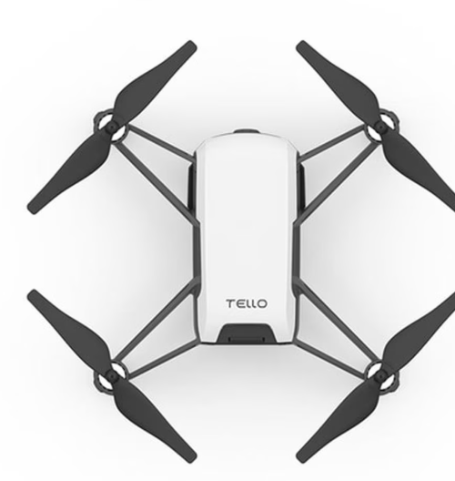

 

<h1 align="center"> Tello Drone</h1>
 
 

### Drone information

DJI Tello is a lightweight hobby drone designed mainly for indoor flying. It is affordable and easy to use, which makes it a good choice for learning high-level robot programming and basic control concepts.

DJI Tello has two version. Edu version gives more options.

                                    Normal version                                                                               Edu version

You can do drone swarming with Edu version 😎

---

### Drone programming

The drone can be controlled in two main ways:

- Using the official mobile app ( Link: [https://www.dji.com/downloads/djiapp/tello](https://www.dji.com/downloads/djiapp/tello) )
- Using a programming interface (SDK)

In this project, I chose to program the drone using **Python**.

The Tello drone does not have a powerful onboard computer for running custom programs. Instead, the control logic runs on a **laptop or desktop computer**.

The communication works as follows:

- The drone creates its own WiFi network.
- The laptop connects to the drone’s WiFi.
- Python code sends commands to the drone over WiFi.
- The drone executes the commands (takeoff, land, move, rotate, etc.).

So essentially, the laptop acts as the “brain,” and the drone acts as the “execution platform.”

For programming the drone, I used the following open-source Python package:

**DJITelloPy**

GitHub link: [https://github.com/damiafuentes/DJITelloPy](https://github.com/damiafuentes/DJITelloPy)

This package provides a simple interface to send commands to the Tello drone using Python. It supports:

- Takeoff and landing
- Movement commands (forward, backward, left, right, up, down)
- Rotation commands
- Battery status reading
- Video streaming

---