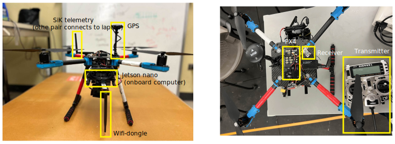

 

<h1 align="center">Drone prototyping and programming (Hardware)</h1>
 
 

#

## A. Drone building phase

1. The quadcopter was built using the **Holybro PX4 Development Kit (X500 V2)**. Link:  https://holybro.com/collections/multicopter-kit/products/px4-development-kit-x500-v2
2. Purchased from: [https://newbeedrone.com/](https://newbeedrone.com/)
3. Drone Assembly guide: 1. Github: [https://docs.px4.io/v1.13/en/frames_multicopter/holybro_x500V2_pixhawk5x.html](https://docs.px4.io/v1.13/en/frames_multicopter/holybro_x500V2_pixhawk5x.html)
                                            2. Youtube: [https://www.youtube.com/watch?v=27rbxCeCq4Y&t=1541s](https://www.youtube.com/watch?v=27rbxCeCq4Y&t=1541s)
                                            3. manual pdf: [https://170693844-files.gitbook.io/~/files/v0/b/gitbook-x-prod.appspot.com/o/spaces%2FLIgtGDAvVGkCKGOJb1bR%2Fuploads%2F8xhWS9GS1JIbEwax8Hsx%2FHolybro_X500_V2_Frame_Kit_Assembly_Guide_en.pdf?alt=media&token=51d15389-5655-4d3c-b379-47b05d7842c9](https://170693844-files.gitbook.io/~/files/v0/b/gitbook-x-prod.appspot.com/o/spaces%2FLIgtGDAvVGkCKGOJb1bR%2Fuploads%2F8xhWS9GS1JIbEwax8Hsx%2FHolybro_X500_V2_Frame_Kit_Assembly_Guide_en.pdf?alt=media&token=51d15389-5655-4d3c-b379-47b05d7842c9)

### Practical Issues I Observed

During assembly, be extremely careful about **short circuits**.  Carbon fiber frames are **conductive**.

Do NOT allow:

- PCBs
- Power distribution board
- Exposed solder joints

to touch the carbon fiber frame directly.

I made this mistake once — it can easily damage components.

Always use proper insulation (standoffs, tape, spacers).

---

## B. Drone working mechanism

**1. Flight Controller**

The drone uses a Pixhawk 6C running PX4 firmware.

PX4 must be flashed before use.

---

**2. Ground Station (QGC)**

Install QGroundControl (QGC) on a laptop.

Used for:

- Flashing firmware, Sensor calibration, Monitoring telemetry, Checking logs etc

Always calibrate sensors before flight.

---

**3. Communication Systems**

(a) Telemetry – SiK Radio

- One module on drone
- One on laptop
    
    Used for QGC monitoring and parameter tuning.
    

(b) RC Controller (Mandatory)

- Receiver on drone
- Transmitter in hand
    
    Used for manual takeover and emergencies.
    

(c) WiFi (Optional)

Only if using an onboard computer.

Used for programming (MAVSDK / ROS / Offboard control).

---

### Important Note

Learn about PX4 and QGC before testing. It is important. Specially get familiar about different modes (altitude, position, etc) of flight operation.

---

### Practical Issues I Observed

- Indoor (Altitude mode): Drone drifts and is unstable ( calibration issue ? ).
- Outdoor (Position mode with GPS): Stable and holds position well.

---

## C. Onboard programming

Drone programming becomes relevant only if you use an **onboard computer** (e.g., Jetson, Raspberry Pi).

Your program runs on the onboard computer and communicates with PX4 via:

- MAVLink
- MAVSDK
- ROS (if used)

---

**Basic Workflow**

1. Flash PX4 on Pixhawk.
2. Verify everything works in QGC (manual flight first).
3. Connect onboard computer via:
    - I used TELEM port (serial) to connect my jetson nano with the pixhawk
4. Establish MAVLink connection. (may be with mavsdk)
5. Test simple commands first:
    - Arm
    - Takeoff
    - Land

---

### D. Using MAVSDK programming

If you are using a **companion computer** (like Jetson), you can control the drone using **MAVSDK**.

1. Create a **WiFi hotspot**
- From your phone, router, or laptop.
1. Connect both devices to the hotspot:
- Companion computer (Jetson onboard)
- Your laptop (ground computer)

Now both devices are in the same network.

1. SSH Into the Onboard Computer from ground computer
2. Now you are inside the Jetson terminal.

        You can:

- Write Python code
- Edit files
- Run MAVSDK programs
- Monitor logs