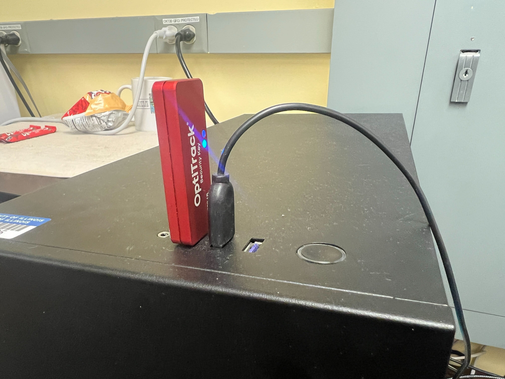
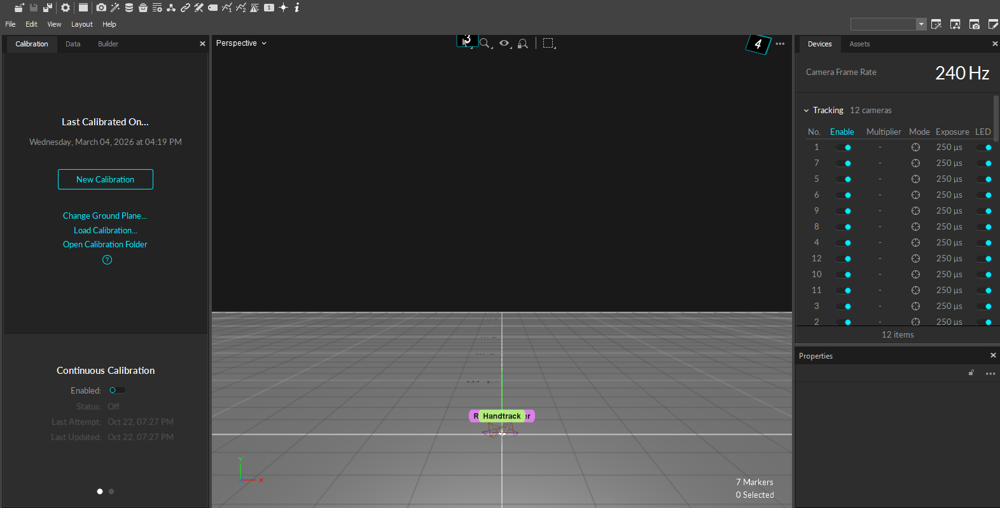
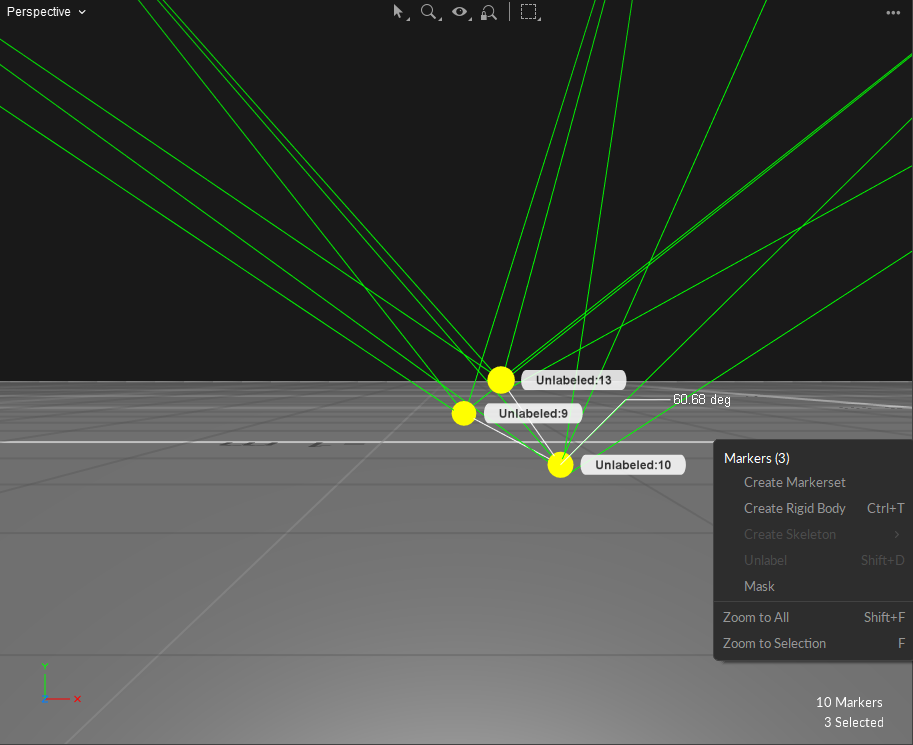
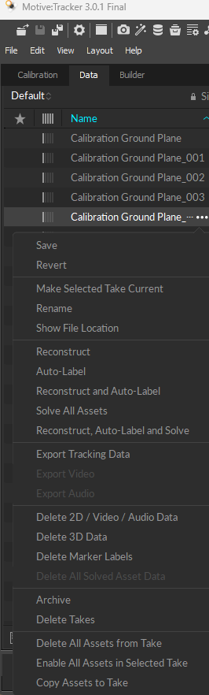

 
<h1 align="center">Motion capture system</h1>
 

### 1. Initial Startup:

Plug in the red usb into the computer. This is a security key that allows access to the motive software. Plug in the power cord for the black box sitting on top of the computer.

  

    
    
<em></em>

  

### 2. Motive Software Overview:

The left panel of the screen shows Calibration, Data, and Builder tabs. This is where you will begin calibrating the cameras, and in the data tab can see the files of previous calibrations and recorded sessions.

The middle shows the different types of camera views. The perspective view allows you to see the camera space along with markers in view that will appear as small white dots. The camera view allows you to see markers in relation to each camera, and in the future wanding phase of calibration allows you to know what areas are covered and which ones need more data. When selecting cameras they will change from blue to green.
The right side devices tab shows the number of cameras and lets you enable/disable them. In the assets tab you have user created rigid bodies. An example being a drone with 4 markers connected together to make one uniform body

  

    
    
<em></em>

  

### 3. Calibration:

Link: <https://youtu.be/aK1cpr6ShPE?si=uQGLzgJgmIzHtpWL&t=136>

Once you have access to the software and have cameras on, you can proceed to calibrating the cameras to the area you will be using to record the data. In the middle of the screen you should see the cameras, shown as small triangular prisms, select all cameras (they should all be green) and click New Calibration on the left side in the calibration tab. Draw a box around all extra markers (white dots) because they will create unnecessary noise and negatively impact the outcome. Or allows the software to mask for you by clicking the mask button.
Take out the wand and make sure to put it together properly, with the end of the stick connecting into the indent of the marker stick. Begin walking around the room waving the wand around in all directions. You want to cover as much of the camera view as possible with color, and collect roughly 6000 samples. Next, you will place the origin on the ground. You need to use the same origin for future data analytics. Changing the origin will change the positional data of the recordings. Excellent Quality outcome is required to move to the next step. Leave on continuous calibration to further enhance the accuracy.

### 4. Creating Rigid Body:

Put markers on the object you want to record. Space them as far apart as possible but allow the most vision from the cameras. Place the marked object in view and in Motive, draw a box around the markers, right click select create rigid body. Connect it to the device and create a central point.

  

    
    
<em></em>

  

### 5. Recording:

When recording data you should name the file specific to your object to make finding the file easier. Leave settings normal with 0s delay and Manual Duration.Toggle off all other objects in the assets tab, to only get your desired object’s data. If having problems disable windows firewall.

### 6. Data File:

The data will open into an excel spreadsheet detailing all marker’s positional data (x,y,z), over time. It has central point data along with individual marker data.

  

    
    
<em></em>

  

Notes

<https://optitrack.com/software/natnet-sdk>\
<https://docs.optitrack.com/quick-start-guides/quick-start-guide-getting-started>

---
 

**Credit: Matthew Wilmington (for creating this documentation)**

 

---